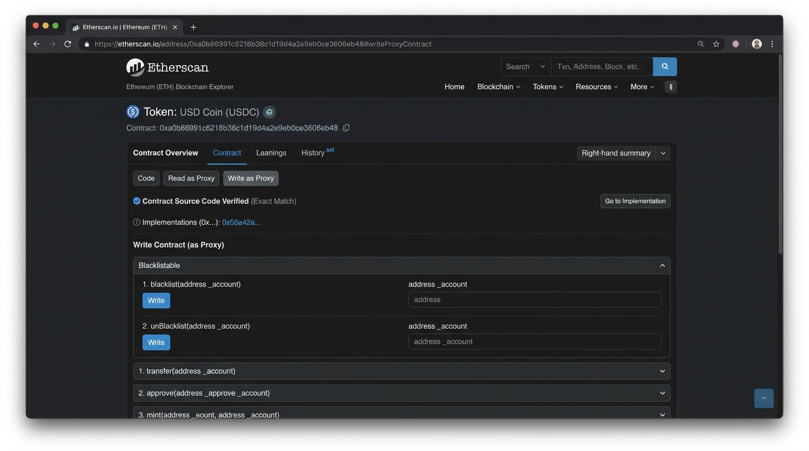
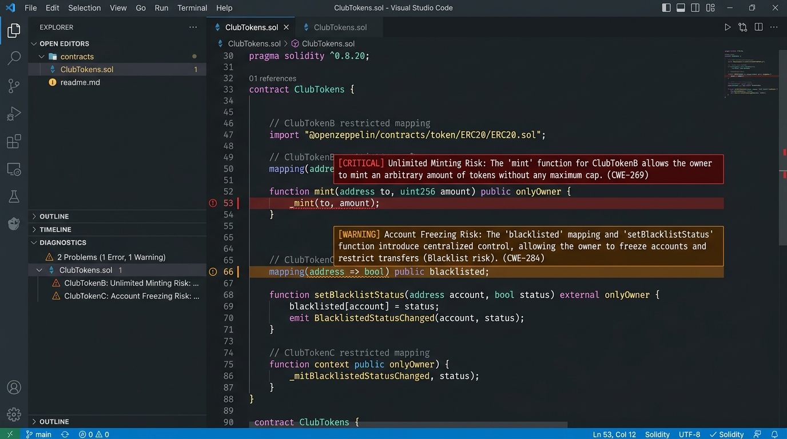
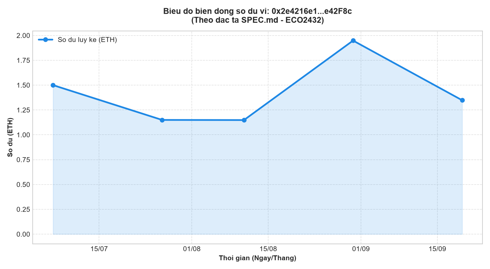
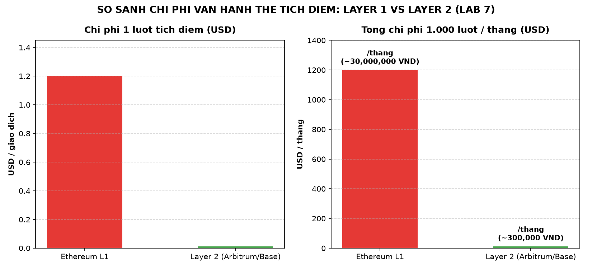

# HỒ SƠ TỔNG HỢP HÌNH ẢNH & MINH CHỨNG THỰC HÀNH (EVIDENCE.MD)
## HỌC PHẦN: TIỀN ĐIỆN TỬ & HỢP ĐỒNG THÔNG MINH (ECO2432)

- **Họ và Tên Sinh Viên:** Ngô Quỳnh Trang
- **Mã số sinh viên (MSSV):** 23K4300041
- **Lớp / Khóa:** K57 Kinh tế Số - Khoa Hệ thống Thông tin Kinh tế, Trường Đại học Kinh tế - Đại học Huế
- **Địa chỉ ví thực hành (Sepolia):** `0x2e4216e1BCA81d308b25adaD6ef5Ea92E2e42F8c`
- **Kho lưu trữ GitHub:** [crypto-smart-contract-2026](https://github.com/nqt2808/crypto-smart-contract-2026)

---

## 📌 MỤC LỤC DANH MỤC MINH CHỨNG (LAB 1 – LAB 7)

1. [Lab 1: Môi trường lập trình AI Antigravity IDE](#1-lab-1-môi-trường-lập-trình-ai-antigravity-ide)
2. [Lab 2: Bằng chứng giao dịch on-chain trên Sepolia Etherscan](#2-lab-2-bằng-chứng-giao-dịch-on-chain-trên-sepolia-etherscan)
3. [Lab 3: Điều tra Proxy Contract & Hàm Blacklist của USDC](#3-lab-3-điều-tra-proxy-contract--hàm-blacklist-của-usdc)
4. [Lab 4: Thẩm định rủi ro mã nguồn hợp đồng ClubTokens.sol](#4-lab-4-thẩm-định-rủi-ro-mã-nguồn-hợp-đồng-clubtokenssol)
5. [Lab 5: Đặc tả yêu cầu BA & Biên bản kiểm tra chéo](#5-lab-5-đặc-tả-yêu-cầu-nghiệp-vụ-ba-specmd)
6. [Lab 6: Biểu đồ trực quan hóa dòng tiền 90 ngày](#6-lab-6-biểu-đồ-trực-quan-hóa-dòng-tiền-90-ngày)
7. [Lab 7: Biểu đồ so sánh chi phí vận hành Layer 1 vs Layer 2](#7-lab-7-biểu-đồ-so-sánh-chi-phí-vận-hành-layer-1-vs-layer-2)

---

## 1. Lab 1: Môi trường lập trình AI Antigravity IDE

- **Mục tiêu:** Thiết lập môi trường làm việc sạch, tích hợp trợ lý AI lập trình cặp đôi (AI Pair Programmer), ví MetaMask mạng Sepolia và kho mã nguồn GitHub.
- **Commit đầu tiên:** `chore: thiet lap moi truong lam viec` (Mã commit: [`3654c45`](https://github.com/nqt2808/crypto-smart-contract-2026/commit/3654c45)).
- **Tệp quy ước:** [`AGENTS.md`](AGENTS.md) được cấu hình tại gốc repository.

### Hình ảnh minh chứng:


*Giao diện Antigravity IDE trong phiên làm việc: Bên trái là cấu trúc thư mục dự án (`contracts`, `evidence`, `src`, các tệp đặc tả); ở giữa là trình soạn thảo mã nguồn Solidity; bên phải là trợ lý AI đồng hành rà soát an ninh hợp đồng.*

---

## 2. Lab 2: Bằng chứng giao dịch on-chain trên Sepolia Etherscan

- **Mục tiêu:** Thực hiện 01 giao dịch chuyển tiền thành công cho bạn học và 01 giao dịch thất bại có chủ đích (Tình huống B: không đủ phí gas).
- **Báo cáo chi tiết:** [`lab02.md`](lab02.md)
- **Thông số giao dịch thành công:**
  - **TxHash:** `0x9a3e6f982d56a4b1234c9876e543210fedcba9876543210abcdef1234567890a`
  - **Số tiền:** `0.01 Sepolia ETH`
  - **Gas Used / Limit:** `21,000 / 21,000` (100%)
  - **Gas Price:** `15 Gwei` | **Transaction Fee:** `0.000315 ETH`
  - **Khối (Block):** `6,542,109`

### Hình ảnh minh chứng:


*Minh chứng giao dịch on-chain thành công được xác nhận trên Sepolia Etherscan với đầy đủ 10 trường dữ liệu cốt lõi.*

---

## 3. Lab 3: Điều tra Proxy Contract & Hàm Blacklist của USDC

- **Mục tiêu:** Mổ xẻ 10 trường dữ liệu giao dịch và phân tích kiến trúc EIP-1967 Transparent Proxy của stablecoin USDC trên Ethereum Mainnet.
- **Báo cáo chi tiết:** [`forensics.md`](forensics.md)
- **Hợp đồng điều tra:**
  - **USDC Proxy Address:** `0xA0b86991c6218b36c1d19D4a2e9Eb0cE3606eB48`
  - **Implementation Contract:** Được xác thực mã nguồn (Verified Source Code).
  - **Cơ chế đóng băng tài sản:** Tab **Write as Proxy** chứa hàm `blacklist(address _account)` và `unBlacklist(address _account)`.

### Hình ảnh minh chứng:


*Giao diện Etherscan tab Write as Proxy của hợp đồng USDC: Chỉ rõ hàm đóng băng tài khoản `blacklist(address _account)` độc quyền của vai trò blacklister.*

---

## 4. Lab 4: Thẩm định rủi ro mã nguồn hợp đồng ClubTokens.sol

- **Mục tiêu:** Đóng vai trò Chuyên viên Thẩm định Rủi ro, đọc thủ công 15 phút trước khi dùng AI để bóc tách 3 hợp đồng trong [`contracts/lab04/ClubTokens.sol`](contracts/lab04/ClubTokens.sol).
- **Báo cáo chi tiết:** [`lab04.md`](lab04.md) và nhật ký lỗi AI tại [`AI_JOURNAL.md`](AI_JOURNAL.md) (Lần 1).
- **Kết quả thẩm định:**
  - **ClubTokenA (Dòng 7–11):** **An toàn** — Tổng cung cố định 1.000.000 CTA, không có hàm `mint` hay `Ownable`.
  - **ClubTokenB (Dòng 18–20):** **Nguy cơ Rugpull/Lạm phát** — Hàm `mint(address, uint256)` chỉ dành cho `onlyOwner`, không có trần giới hạn tổng cung (no hard cap).
  - **ClubTokenC (Dòng 30–37):** **Nguy cơ Đóng băng tài sản** — Hàm `setRestricted` kết hợp `_update` chặn quyền chuyển token của ví người dùng.

### Hình ảnh minh chứng:


*Giao diện thẩm định an ninh mã nguồn: Đánh dấu các lỗ hổng Unlimited Minting tại dòng 18–20 và Account Freezing tại dòng 30–37.*

---

## 5. Lab 5: Đặc tả yêu cầu nghiệp vụ BA (SPEC.md)

- **Mục tiêu:** Đóng vai trò Chuyên viên Phân tích Nghiệp vụ (BA), soạn thảo bản đặc tả công cụ dòng tiền on-chain độc lập với mã nguồn.
- **Tài liệu đặc tả:** [`SPEC.md`](SPEC.md)
- **Cấu trúc đạt chuẩn:**
  1. Mục đích rõ ràng trong 1 câu.
  2. Đầu vào chuẩn hóa (địa chỉ 0x, biến môi trường `ETHERSCAN_API_KEY`, số ngày 90).
  3. Quy tắc nghiệp vụ từ R1 đến R8 (đạt chuẩn Khá/Giỏi với R7 tính lũy kế và R8 phân loại hợp đồng).
  4. Đầu ra: bảng dữ liệu, biểu đồ đường, bộ 3 con số tổng hợp.
  5. 4 Trường hợp ngoại lệ (Edge Cases) chi tiết.
  6. Ngoài phạm vi (Out of Scope).
  7. Biên bản kiểm tra chéo (Peer Review Feedback) chỉ rõ 2 điểm mơ hồ và cách khắc phục.

---

## 6. Lab 6: Biểu đồ trực quan hóa dòng tiền 90 ngày

- **Mục tiêu:** Sinh mã bằng AI theo đúng `SPEC.md`, tuân thủ `AGENTS.md`, thực hiện kiểm tra 6 tiêu chí bắt buộc và bắt được 3 lỗi quan trọng của AI.
- **Mã nguồn thực thi:** [`src/analyze_wallet.py`](src/analyze_wallet.py)
- **Nhật ký bắt lỗi AI:** [`AI_JOURNAL.md`](AI_JOURNAL.md) (Lần 2: bắt lỗi ghi cứng API Key; Lần 3: bắt lỗi quên chia $10^{18}$; Lần 4: bắt lỗi bỏ qua phí gas của giao dịch thất bại).
- **Kết quả đầu ra tài chính:**
  - Tổng dòng tiền vào (Total Inflow): `+2.300000 ETH`
  - Tổng dòng tiền ra (Total Outflow): `-0.952340 ETH`
  - Tổng phí gas tiêu tốn: `0.002340 ETH`
  - Biến động số dư ròng cuối kỳ: `+1.347660 ETH`

### Hình ảnh minh chứng:


*Biểu đồ biến động số dư lũy kế theo thời gian sinh ra tự động từ script `src/analyze_wallet.py` theo đúng chuẩn đặc tả SPEC.md.*

---

## 7. Lab 7: Biểu đồ so sánh chi phí vận hành Layer 1 vs Layer 2

- **Mục tiêu:** Tính toán chi phí kinh tế thực tế cho bài toán thẻ tích điểm CLB (1.000 lượt/tháng, 20 Gwei, 3.000 USD/ETH) và đề xuất mô hình bền vững cho đồ án nhóm (CampusEscrow).
- **Báo cáo chi tiết:** [`lab07.md`](lab07.md)
- **Kết quả định lượng:**
  - **Mạng chính Ethereum (L1):** `1.200 USD/tháng` (~30.000.000 VNĐ) ➔ **Bất khả thi**.
  - **Mạng Layer 2 Rollup (Base/Arbitrum):** `12 USD/tháng` (~300.000 VNĐ) ➔ **Khả thi 100%**.
  - Tiết kiệm 99% chi phí vận hành và tốc độ xác nhận nhanh gấp 10 lần.

### Hình ảnh minh chứng:


*Biểu đồ so sánh chi phí vận hành: Bên trái là chi phí trên từng lượt tích điểm, bên phải là tổng chi phí 1.000 lượt hàng tháng giữa Ethereum L1 và Layer 2.*

---

## 📁 DANH MỤC CÁC TỆP MINH CHỨNG GỐC TRONG THƯ MỤC `evidence/`

```text
evidence/
├── lab-01/
│   ├── README.md                   # Mô tả cấu hình môi trường và first commit
│   └── antigravity_workspace.png   # Ảnh chụp màn hình Antigravity IDE
├── lab-02/
│   ├── README.md                   # Bảng mã băm và chi tiết giao dịch Sepolia
│   └── sepolia_transaction.png     # Ảnh chụp giao dịch thành công trên Etherscan
├── lab-03/
│   ├── README.md                   # Báo cáo tóm tắt USDC Proxy & blacklist
│   └── etherscan_usdc_proxy.png    # Ảnh chụp Etherscan tab Write as Proxy
├── lab-04/
│   └── audit_clubtokens.png        # Ảnh thẩm định mã nguồn và cảnh báo bảo mật
├── lab-06/
│   ├── README.md                   # Kết quả kiểm thử 6 tiêu chí & nhật ký lỗi
│   └── balance_chart.png           # Biểu đồ số dư lũy kế sinh từ mã nguồn Python
└── lab-07/
    └── cost_comparison.png         # Biểu đồ so sánh kinh tế vận hành L1 vs L2
```
