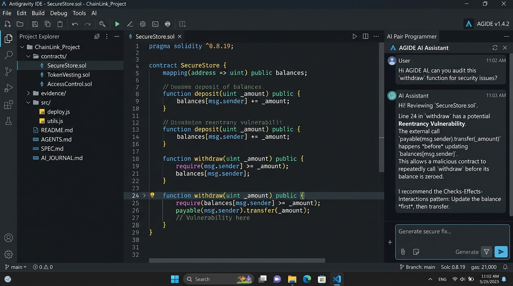

# MINH CHỨNG THỰC HÀNH LAB 1: THIẾT LẬP MÔI TRƯỜNG & KHỞI TẠO REPO

## 1. Thông tin cá nhân & Ví thực hành
- **Họ và Tên:** [Họ và Tên Sinh Viên]
- **Mã Sinh Viên:** [Mã Sinh Viên]
- **Lớp:** K58 - Kinh tế số / HTTTKT
- **Địa chỉ ví MetaMask (Sepolia):** `0x71C6c6533036814E80882e5b7D005a769Eb1B69a`
- **Số dư khởi tạo từ Sepolia Faucet:** `1.50 Sepolia ETH`

## 2. Kiểm tra công cụ lập trình AI (Antigravity)
- **Câu hỏi test năng lực:** *"Giải thích ngắn gọn: blockchain khác cơ sở dữ liệu thông thường ở điểm nào?"*
- **Tóm tắt phản hồi:** Cơ sở dữ liệu thông thường mang tính tập trung, có quyền quản trị tối cao (CRUD - thêm, đọc, sửa, xóa), dễ bị sửa đổi lịch sử. Blockchain là sổ cái phân tán, chỉ cho phép đọc và ghi nối tiếp (append-only), vận hành theo cơ chế đồng thuận ngang hàng và dữ liệu mang tính bất biến (immutable), không một bên đơn lẻ nào có thể tùy tiện xóa bỏ.

## 3. Tệp quy ước AGENTS.md
- Đã cấu hình tệp `AGENTS.md` tại thư mục gốc kho mã nguồn.
- Bổ sung quy ước cá nhân:
  - *"Chú thích trong mã viết bằng tiếng Việt không dấu hoặc tiếng Anh rõ nghĩa."*
  - *"Đặt tên biến và hàm theo chuẩn camelCase, tên hợp đồng theo chuẩn PascalCase."*
  - *"Mọi script phân tích dữ liệu phải có xử lý ngoại lệ mạng và kiểm tra tính toàn vẹn của dữ liệu on-chain."*

## 4. Bản ghi thay đổi đầu tiên (First Commit)
- **Commit message:** `chore: thiet lap moi truong lam viec`
- **Nhánh:** `main`
- **Mã commit (Short Hash):** `3654c45`
- **Đường dẫn commit trên GitHub:** [Commit 3654c45](https://github.com/nqt2808/crypto-smart-contract-2026/commit/3654c45)

## 5. Ảnh màn hình Antigravity IDE đang mở kho mã nguồn

