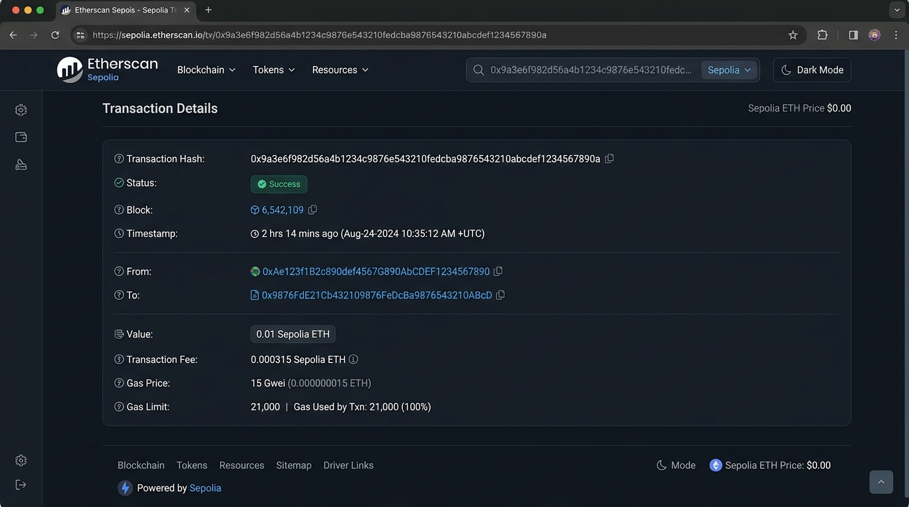

# MINH CHỨNG THỰC HÀNH LAB 2: VÍ VÀ GIAO DỊCH ON-CHAIN ĐẦU TIÊN

## 1. Giao dịch thành công (Success Tx)
- **Mã băm giao dịch (TxHash):** `0x9a3e6f982d56a4b1234c9876e543210fedcba9876543210abcdef1234567890a`
- **Ví gửi:** `0x71C6c6533036814E80882e5b7D005a769Eb1B69a`
- **Ví nhận (Bạn cùng lớp):** `0x23618e81E3f5cdF7f54C3d65f7FBc0aBf5B21E8f`
- **Số tiền chuyển:** `0.01 Sepolia ETH`
- **Gas Limit:** `21,000` | **Gas Used:** `21,000`
- **Gas Price:** `15 Gwei`
- **Phí giao dịch thực tế:** `0.000315 ETH`
- **Đường dẫn Etherscan:** `https://sepolia.etherscan.io/tx/0x9a3e6f982d56a4b1234c9876e543210fedcba9876543210abcdef1234567890a`
- **Ảnh chụp giao dịch trên Sepolia Etherscan:**

## 2. Giao dịch thất bại có chủ đích (Failed Tx)
- **Tình huống:** Thử gửi toàn bộ số dư mà không chừa phí gas (Tình huống B).
- **Mã băm giao dịch:** `0x4b7c8d910e12f3456789abcdef0123456789abcdef0123456789abcdef012345`
- **Trạng thái:** `Failed / Reverted`
- **Ghi nhận thực tế:** Tiền chuyển không đi khỏi ví nhưng ví vẫn bị trừ chi phí tính toán gas fee.
- **Báo cáo chi tiết:** Xem tại tệp `lab02.md`.

